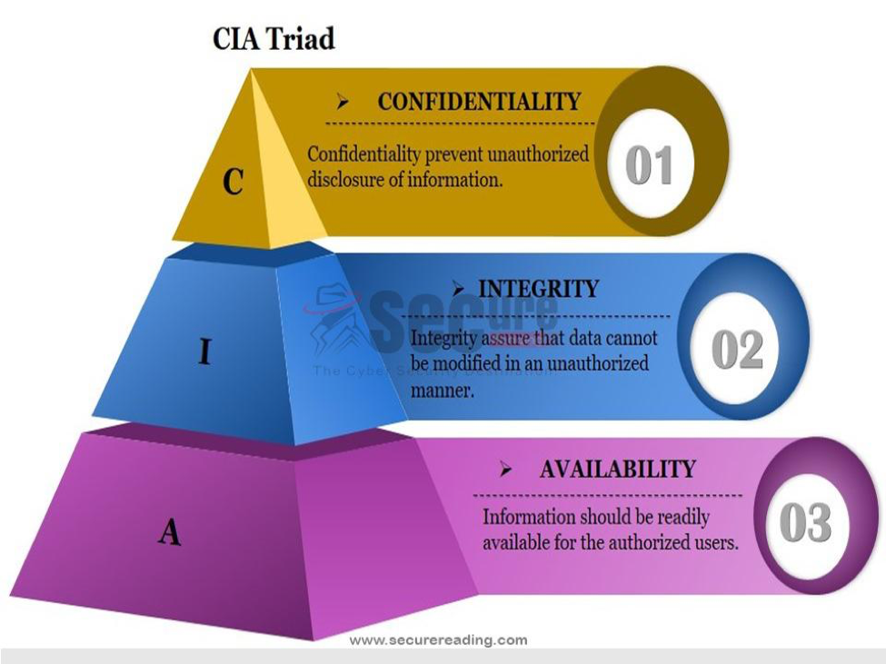

# Web Security
[Course Repo](https://github.com/Make-School-Courses/BEW-2.3-Web-Security)

Tutorial Resource: [Hacksplaining: Learn to Hack](https://www.hacksplaining.com/)

[DAY 1] Binary has two states 0 and 1 similar to on and off like a light switch.
- Make School's Presentation [slides on number bases][number bases slides]

[DAY 3] I learned that recursive functions are the same as for loops under the hood.
- [Cool Wordsmith's Internet Anagram Server](http://www.wordsmith.org/anagram/)

[DAY 5] When you see node = node.next in a Linkedlist implementation, first we ask the node what is the next node then we assign it to node
-[Linkedlist Resoureful Article Part 2](https://medium.com/basecs/whats-a-linked-list-anyway-part-1-d8b7e6508b9d)

[DAY 9] Trees in CS are weird upside down trees with nodes, edges, height, levels, depth and a root.
- [Make School Tree Slides](https://github.com/campbellmarianna/Core-Data-Structures/blob/master/Lessons/slides/Trees.pdf)

[DAY 11] Recursion is a function called when it is done it returns to where it was called.
-

[DAY 14] Spend more time doing the stuff that matters.
- [Twilio Documentation](https://www.twilio.com/docs/api)